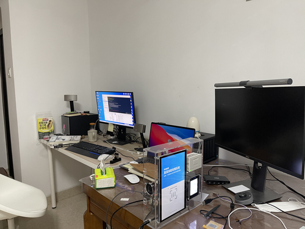

# 前端技术栈实现硬件收银机
*造这台机器想法很久了，从想法萌生、机箱设计图到硬件选型再到软件实现以及验证，前前后后零零碎碎花了不少时间；真正写代码的时间用了10来天。*

## 展示
[演示视频点此](https://www.bilibili.com/video/BV1AB4y1K7cW/)   
图片：  

## 服务端
[源码点此](https://github.com/lilindog/payment-machine-srv)   
服务端使用nodejs、mysql、koa; 没什么好说的。  
支付接口接入支付宝的接口。   

## 设备端
[源码点此](https://github.com/lilindog/payment-machine-device)   

硬件部分：   
核心部分为树莓派4b一块，操作系统使用官方linux发行版，基于Debian。   
二维码扫描器品牌为微光互联，根据厂家文档协议写nodejs[驱动](https://github.com/lilindog/vguang-scanner)。      
打印机来自广州优库，根据厂家文档协议写nodejs[驱动](https://github.com/lilindog/escpos-printer)。   
屏幕品牌不详，支持多点触摸电容屏ips面板，1024x600分辨率。   

软件部分：   
采用nwjs（开发阶段）、electron(实际运行)。   
ui编写采用Ract、antd-mobile。   
## 管理后台
[源码点此](https://github.com/lilindog/payment-machine-admin)   
使用vue2、elemtn-ui开发，没什么好讲的。
